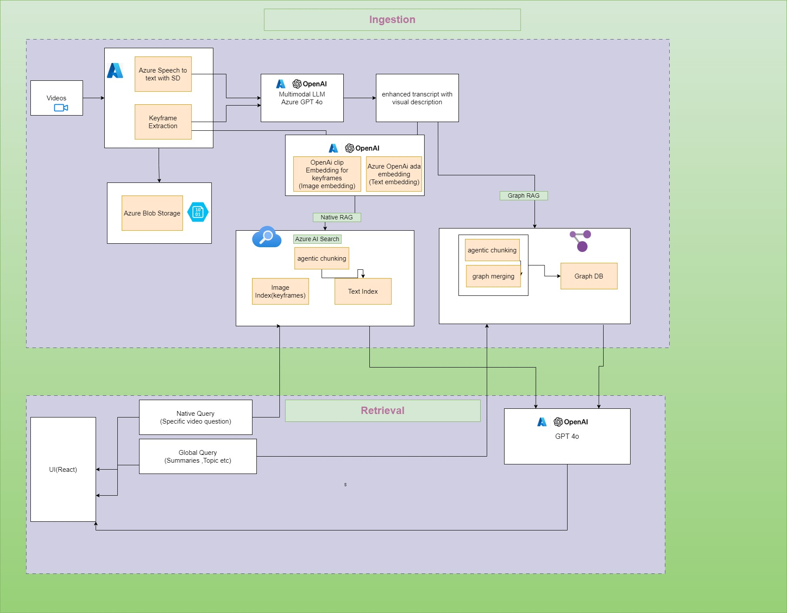

# VidSage
https://www.youtube.com/watch?v=IUSCWtB9jWk

VidSage focuses on processing video data, storing it in Azure AI services, and enabling advanced local and global querying through techniques - Azure AI Search (Native RAG), Graph-based Retrieval (Graph RAG), Open AI CLIP Model (Image Embeddings), Azure GPT-4o.

## Table of Contents

- [Introduction](#introduction)
- [Architecture](#architecture)
- [Features](#features)
- [Technology Stack](#technology-stack)
- [Installation](#installation)
- [Querying](#querying)
  - [Local Querying](#local-querying)
  - [Global Querying](#global-querying)
- [Contributing](#contributing)
- [License](#license)

## Introduction

VidSage provides detailed business insights of videos using Azure AI Search, Advanced Graph RAG capability to analyze all the videos. 
Platform intelligent multi-modal chunking strategy helps it to point to the exact section in the video where a particular topic is discussed.

## Architecture

<!-- ![Architecture Diagram] -->


The architecture consists of several stages:

1. **Video Upload**: Videos are uploaded to the repository.

2. **Processing**: Extract text using Azure Speech-to-Text (STT) service with speaker diarization and image keyframes from the videos.

3. **Transcript Enhancement**: 
   - Text transcripts are enhanced with keyframe descriptions using **Azure OpenAI GPT-4o**.

3. **Embedding Creation**: 
   - Text embeddings are generated using the **Azure OpenAI Ada embedding model**.
   - Image embeddings are generated using **OpenAI CLIP model**.

4. **Azure AI Search**:
   - Store text embeddings in a **text index**.
   - Store image embeddings in an **image index**.

6. **GRAPH RAG**:
   - Graph database to create a graph for our enhanced transcripts.
   - For the GraphRAG we use advanced agentic chunking to convert all the sentences in a transcript to standalone sentences and then chunk the transcripts into relevant and meaningful chunks using GPT 4o mini. These chunks are connected to Video node.
   - For any video, we extract all the entities and relationships along with it, we create a Video node and summary node which contains video text transcript, Summary of the transcript as well as all the topics, features, issues, speakers and sentiment of the video.
   - Whenever a new video gets uploaded we use entity disambiguation to ensure that the entities with similar name and meaning are not repeated.
   - Graph is structured in a way that any point of time it represents the overall discussions happening through all the videos processed by the platform. This helps the Graph RAG to better answer queries compared to native RAG. Native RAG will be able to answer based only on the chunks retrieved which may miss out the overall knowledge representation.
    
6. **Storage**: Enhanced text transcripts and image keyframes are stored in **Azure Vector Index** for efficient retrieval.

## Features

- **Speaker Diarization**: Distinguish between multiple speakers in the video transcripts.
- **Keyframe Extraction**: Extract image keyframes to associate with text data.
- **Advanced Embeddings**: Use OpenAI models for generating text and image embeddings.
- **Graph Database Integration**: Store and retrieve data in a structured graph format using **Graph RAG**.
- **Entity Disambiguation**: Avoid repetition of entities with similar names and meanings.
- **Local and Global Querying**: Retrieve information specific to a video or across the entire video repository.

## Technology Stack

- **Azure AI Search** for text and image indexes and retrieval
- **Azure Speech-to-Text** (STT) with speaker diarization
- **Azure OpenAI** (Ada embedding model, GPT-4o)
- **OpenAI CLIP** for image embeddings
- **Graph RAG** for graph-based retrieval
- **Entity and Relationship Extraction** for knowledge graph construction

## Installation

1. **Clone the repository**:
   ```bash
   git clone git@github.com:sujithrkumar/ms_raghack.git
   cd rag_hack/api
   ```

2. **Install Dependencies**:
   Make sure you have Python 3.8+ (Tested with Python 3.10) installed. Then, install the required dependencies:
   ```bash
   pip install -r requirements.txt
   ```

3. **Azure Configuration**:
   Set up the following Azure services:
   - **Azure Speech-to-Text**
   - **Azure OpenAI** for text and image embeddings
   - **Azure AI Search** for vector indexing

4. **Environment Variables**:
   Set your Azure credentials in an `.env` file in the root directory:
   ```bash
   IS_DEV="True"
   SPEECH_KEY="<Azure STT Key"
   SPEECH_REGION="<STT region>"
   AZURE_STORAGE_CONNECTION_STRING="<Azure BLOB storage connection string>"
   BLOB_ACCOUNT_KEY="<BLOB account key>"
   AZURE_OPENAI_KEY="<Azure OpenAI Key>"
   AZURE_OPENAI_ENDPOINT="<Azure OpenAI endpoint>"
   AZURE_SEARCH_API_KEY="<Azure AI Search API Key>"
   AZURE_SEARCH_ENDPOINT="<Azure AI Search Endpoint>"
   AZURE_OPENAI_ENDPOINT_EMBED="<Azure OpenAI Embedding Endpoint>"
   AZURE_OPENAI_API_KEY_EMBED="<Azure OpenAI Embedding Key>"
   AZURE_OPENAI_API_VERSION_EMBED="<Azure OpenAI API Version>"
   NEO4J_URI = "<NEO4J URI>"
   NEO4J_USERNAME = "<NEO4J Username>"
   NEO4J_PASSWORD = "<NEO4J password>"
   AURA_INSTANCEID = "<AURA instance ID>"
   AURA_INSTANCENAME = "<AURA instance name>"
   PRIVATE_OPENAI_API_KEY = "<OpenAI GPT4o mini key for graph db data ingestion>"
   ```
   
## Querying

### Local Querying

Local querying is performed for questions based on a specific video.

1. **Native Retrieval-Augmented Generation (RAG)**: Uses **Azure AI Search** to retrieve relevant text chunks and image keyframes related to the query.
2. **Response Generation**: The retrieved information is passed through **Azure GPT-4o** to generate answers.

### Global Querying

Global querying is performed across the entire video repository, including summary-based questions.

1. **Graph RAG**: Extracts relevant nodes from the graph using **vector search** and **graph traversal**.
2. **Response Generation**: Passes the structured data to **Azure GPT-4o** to generate a detailed response.

## Contributing

We welcome contributions to improve the project! Please follow these steps:

1. Fork the repository.
2. Create a new branch (`git checkout -b feature-branch`).
3. Commit your changes (`git commit -am 'Add new feature'`).
4. Push to the branch (`git push origin feature-branch`).
5. Open a Pull Request.
